# 🚀 SAP CPI - Router com XPath vs Header (Dynamic Routing)

🔷 Este projeto demonstra como implementar **roteamento dinâmico no SAP Cloud Integration (CPI)** utilizando duas abordagens:

- 🔹 **Header (Non-XML)**
- 🔹 **XPath (XML)**

O objetivo é mostrar, na prática, **diferenças de performance, uso e boas práticas** dentro de um iFlow real.
Neste exemplo a integração recebe um XML com dados de carros e decide a rota com base no ID ou no status do veículo.

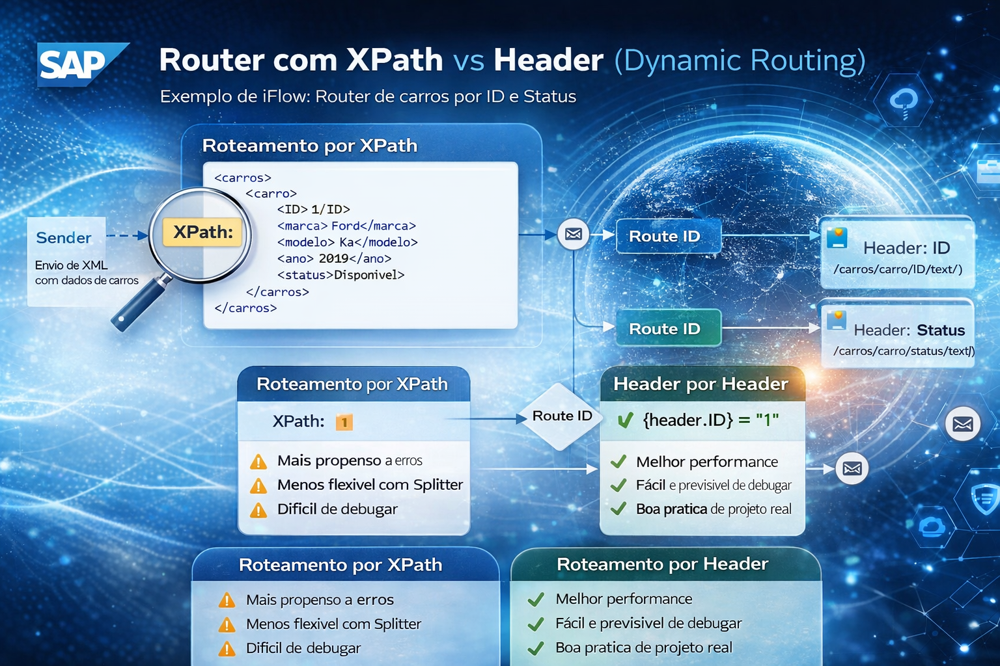

---

# :building_construction: Arquitetura do iFlow

# 🔄 Fluxo da Integração

# Entrada no Postman

1. 📥 Entrada (Postman)
```
POST /carros
```

```
<carros>
    <carro>
        <ID>1</ID>
        <marca>Fiat</marca>
        <modelo>Argo</modelo>
        <ano>2021</ano>
        <status>Reservado</status>
    </carro>   
</carros>
```
<br>

2. Criando o Pacote 

## Criando o Pacote
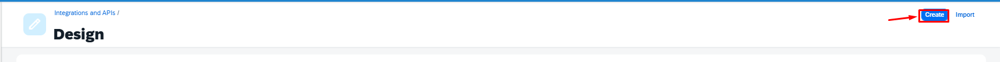

<br>

## Nome o Pacote
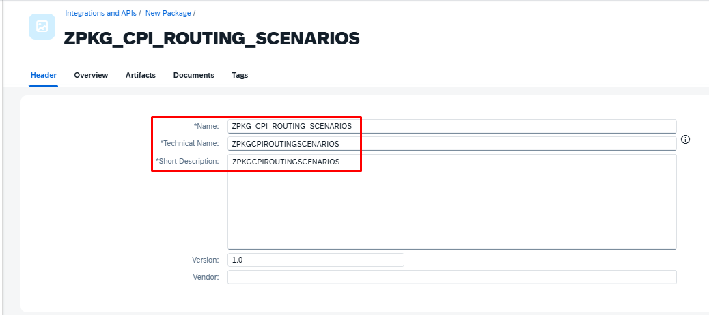
```
ZPKG_CPI_ROUTING_SCENARIOS
```
<br>

## Adicionando o Artefato
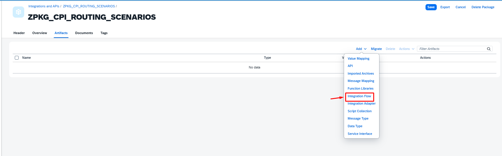

<br>

## Nome do Integration Flow
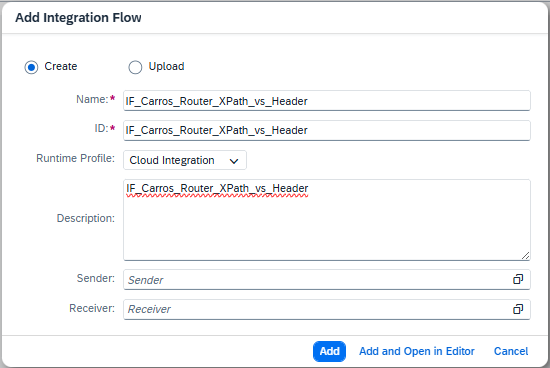
```
IF_Carros_Router_XPath_vs_Header
```
<br>

## Editando o iFlow
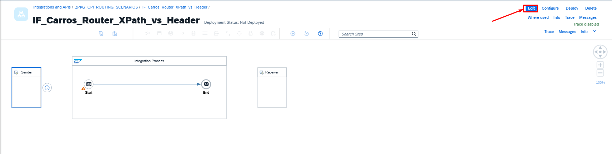

<br>

## Adicionando o Adapter HTTPS
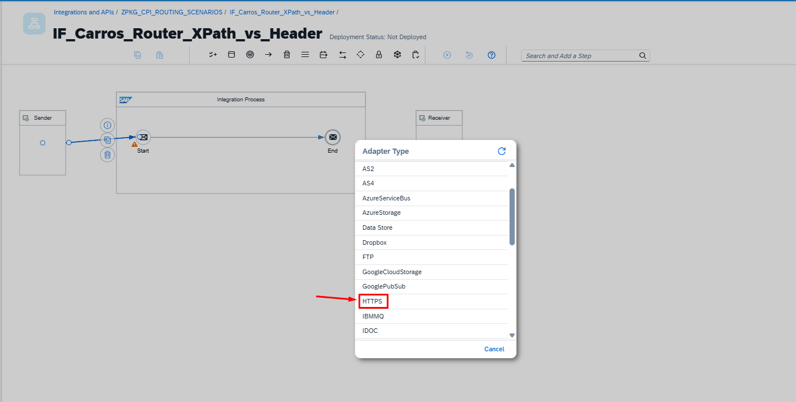

<br>

## HTTPS
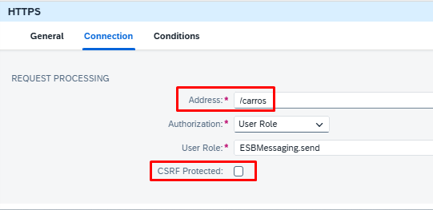
```
/carros
```

<br>

## Adicionando o Content Modifier
3. 🧩 Content Modifier (CM_setHeader)
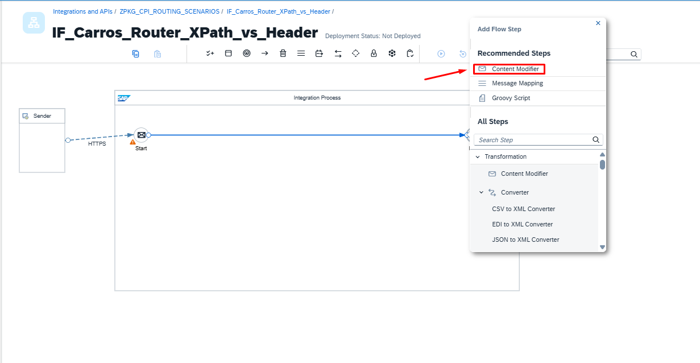

<br>

## Renomeamos o Content Modifier
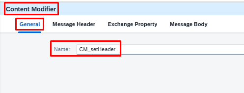
Renomeamos o Content Modifier 
```
General
Name: CM_setHeader
```
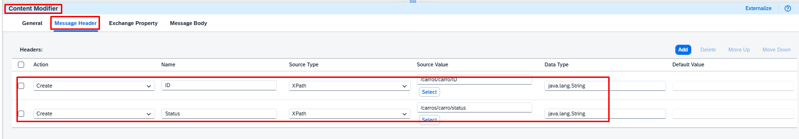
Extrai dados do XML e transforma em headers
Em Header adicionamos
```
Message Header
Create -	Status	-	XPath	-	/carros/carro/status	-	java.lang.String
Create -	ID	   -	XPath	-   /carros/carro/ID	    -	java.lang.String
```
👉 Isso permite usar lógica Non-XML no Router
<br>

## Router

4. 🔀 Router (Decisão de Rota)

O roteamento possui 3 caminhos:

## Adicionando o Router
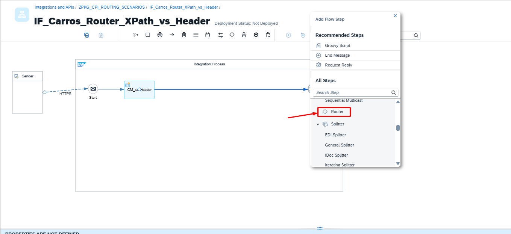


<br>
<br>
<br>
<br>
<br>
<br>
<br>
<br>
<br>
<br>
<br>
<br>
<br>
<br>
<br>
<br>
<br>
<br>
<br>
<br>
<br>
<br>
<br>


🟢 Rota 1 — Baseada em Header (Non-XML)

Condição:

${header.ID} = '1'

✔ Mais performática <br>
✔ Ideal para integrações complexas <br>
✔ Evita parsing XML repetido <br>

🔵 Rota 2 — Baseada em XPath (XML)

Condição:

/carros/carro/status = 'Disponível'

✔ Direto no payload <br>
✔ Útil quando não há header <br>

⚠ Mais custosa (parse XML) <br>

⚪ Rota Default <br>

Caso nenhuma condição seja atendida.

5. 📤 Resposta por Rota

Cada rota retorna um XML diferente:

🟢 Rota ID <br>
```
<resultado>
    <rota>ROTA Non-XML</rota>
    <tipo>Carro ID 1</tipo>
    <mensagem>Carro 1 está Reservado</mensagem>
</resultado>
```

<br> <br>

🔵 Rota Status <br>
```
<resultado>
    <rota>ROTA XML</rota>
    <tipo>Carro ID 1</tipo>
    <mensagem>Carro 1 está Disponível</mensagem>
</resultado>
```

<br>

⚪ Default
```
<resultado>
    <tipo>Outros</tipo>
    <mensagem>Rota padrão</mensagem>
</resultado>
```

<br>

2. 🧩 Content Modifier (CM_setHeader)

Extrai dados do XML e transforma em headers:

ID → /carros/carro/ID
Status → /carros/carro/status

👉 Isso permite usar lógica Non-XML no Router

3. 🔀 Router (Decisão de Rota)

O roteamento possui 3 caminhos:

🟢 Rota 1 — Baseada em Header (Non-XML)

Condição:

${header.ID} = '1'

✔ Mais performática <br>
✔ Ideal para integrações complexas <br>
✔ Evita parsing XML repetido <br>

🔵 Rota 2 — Baseada em XPath (XML) <br>

Condição:

/carros/carro/status = 'Disponível'

✔ Direto no payload <br>
✔ Útil quando não há header <br>

⚠ Mais custosa (parse XML)

⚪ Rota Default

Caso nenhuma condição seja atendida.

4. 📤 Resposta por Rota

Cada rota retorna um XML diferente:

🟢 Rota ID
```
<resultado>
    <rota>ROTA Non-XML</rota>
    <tipo>Carro ID 1</tipo>
    <mensagem>Carro 1 está Reservado</mensagem>
</resultado>
```
🔵 Rota Status
```
<resultado>
    <rota>ROTA XML</rota>
    <tipo>Carro ID 1</tipo>
    <mensagem>Carro 1 está Disponível</mensagem>
</resultado>
```
⚪ Default
```
<resultado>
    <tipo>Outros</tipo>
    <mensagem>Rota padrão</mensagem>
</resultado>
```


---

## 📦 Exemplo prático – iFlow para baixar

📦 [Download do iFlow – Carros_Router_XPath_vs_Header](https://github.com/souzajean/Carros_Router_XPath_vs_Header/raw/main/Package/IF_Carros_Router_XPath_vs_Header.zip)
